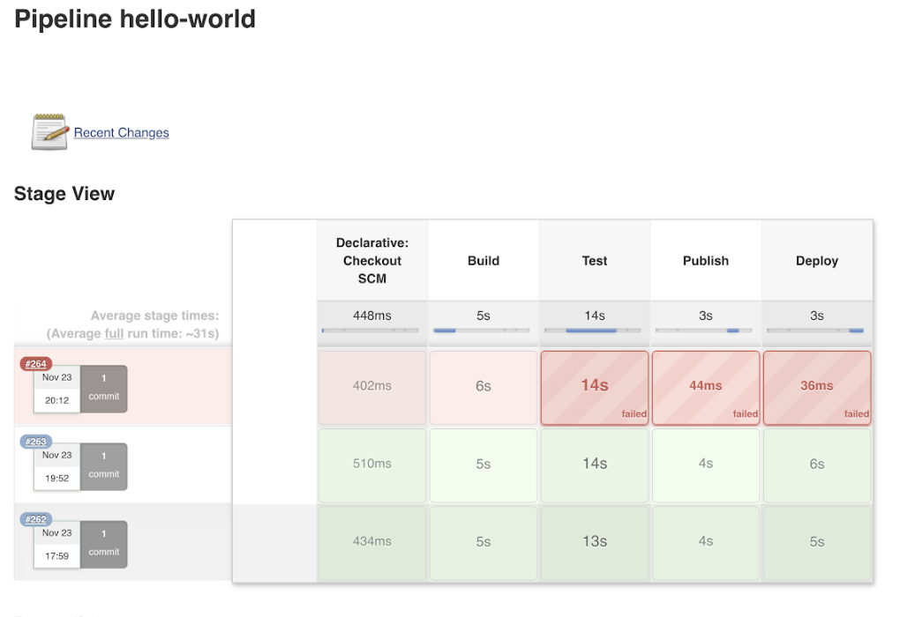

  
*  **Thou shalt always think about readability of code:**  
   In short readability boils down to "*I like reading it*". Make sure whatever code you are writing, 
   it is easy to follow logically. Always keep in mind basic principles like [DRY](https://en.wikipedia.org/wiki/Don%27t_repeat_yourself) which stands for Don't Repeat Yourself.
   Also known as **DIE** Duplication is Evil.
 
*  **Thou shalt always provide meaningful variable names:**  
   You shouldn't be writing code like this:  
    
    A proper variable name depicts its purpose but not its value.
   

*  **Thou shalt not steal code from others:**  
       
   
   Be careful when using someone else's code. If you copy and paste the code into your program, 
   please make sure that you aren't violating any contract as mentioned in the licenses.

*  **Thou should run the unit, functional and (or) integration tests (as appropriate) before making a commit:**  
   Don't forget to run unit tests and integration tests
   before making a commit. Testing before you commit is simply an added layer of protection. 
   It helps you to find errors, and bugs more quickly, before they are pushed to your server. Hence helps in improving code quality. 

*  **Thou shalt not commit secrets to open source code repositories:**  
     
   
   Never commit any keys or secrets to an open source repository because there are many people who go through the commit history of public repositories 
   looking for such things and using them for no good.  
   You can use **key vaults**, **ennvironment variables** e.t.c 
   
*  **Thou shalt heed Java warnings in IntelliJ or Eclipse  - eg unused code, declarations that could be moved closer to scope etc:**   
   Make sure you remove unused code, use static code analysis plugins ( like checkstyle, PMD e.t.c ) which can help in finding out unused code.      

*  **Thou shalt ensure pipeline ( all stages of pipeline including tests ) is green:**    
   Never comment out tests which are causing build failure, always fix the code which are causing the current 
   tests to fail. It's ok for the pipeline to fail but it's not good to skip the tests for the sake of pipeline 
   to be green. 
    
*  **Thou shalt not leave the build Red and go home:**  
   If your commit at the end of day is causing the build to fail, then either revert your commit or fix the build before calling it a day.
   This would not cause problem for other developers to push their code changes. 
   
*  **Thou shalt not checkin on Red build:**  
     
   
   Make sure to not perform any new checkin on red build, unless you are fixing the already existing build failure.  
   This would keep the debugging of CI/CD pipelines easier and faster. 
  
*  **Thou shalt push shorter and frequent commits:**  
   Short and frequent commits provides early feedback from unit tests running on a CI server and other stake holders (Leads, testers, product managers e.t.c...), 
   which encourages the idea of continuous improvement.     
   This does not mean that if you have changed the name of a variable that is used in 15 files then you should create 15 separate commits.
   Basic principle to keep in mind, whatever code changes that belong together, they should be committed together, not separately but frequently.  
  
*  **Thou shalt revert the commit in case it fails and fix is going to take longer:**  
   If you are not sure of the code fix and if it is taking longer time, do not block others to commit the code.
   Just revert your commit and then try to fix on your local first, run all tests and then push your commit.    
   
*  **Thou shalt take feedback constructively and not shy away from sharing constructive feedback with your colleagues:** 
   Learn the *Art Of Giving Constructive Feedback* so that you can focus on the situation or action instead of being personal.
    
*  **Thou shalt update the dev Wiki (Confluence) with any new patterns, approaches, techie things of interest:**    
   Whenever there is a new design decision or any new patterns evolved in the architecture, make sure 
   to capture in the documentation in the form of ADRs ( *Architecture Decision Records* ) on confluence or
   whatever tool you are using.   
   
*  **Thou shalt callout, discuss and share the high level design decisions for all the critical and major functional areas before implementation:**   
   Call out a technical huddle as and when needed so that you can take help from team members and seek other opinions and ideas 
   in that brainstorming session.
    
*  **Thou shalt keep JIRA and Confluence updated:** :smile:

*  **Thou shalt agree to meet each quarter & have a constructive conversation about our performance against these guiding principles and identify areas of improvement** 
    

