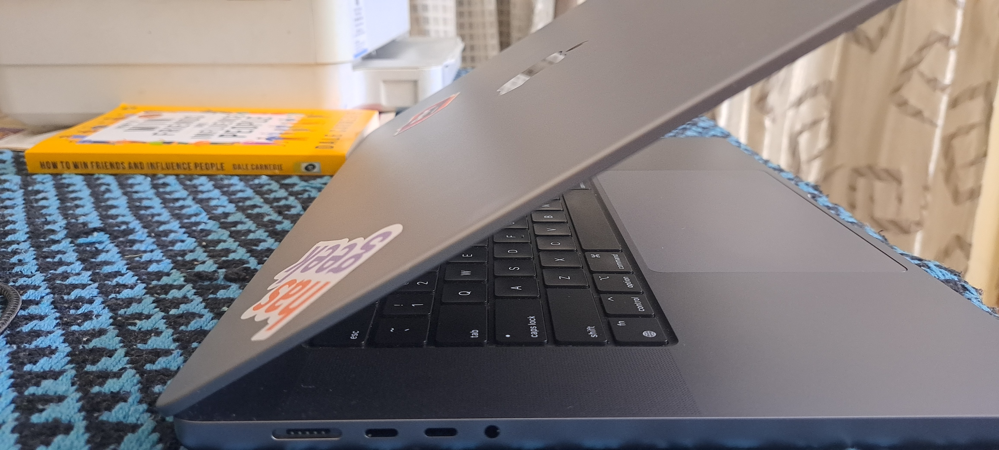
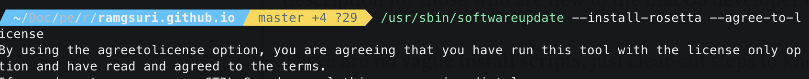
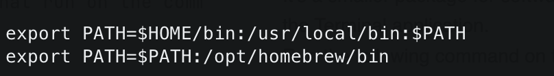
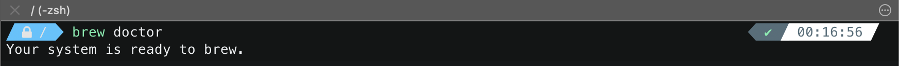
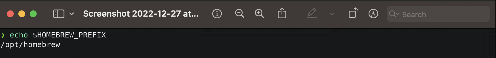

{: .box-note}       
If you are a Developer and trying to setup your new MAC M1 machine,  
then this post can help you to get started with the Dev Machine setup.

### 1. Rosetta 2 
* Rosetta 2 is an x86–64 compatibility layer developed by Apple so you can install and run apps that 
haven’t been ported to ARM yet.

* Run the following command on terminal.
  ```shell
  /usr/sbin/softwareupdate --install-rosetta --agree-to-license on the terminal 
  ```

### 2. Xcode Command Line Tools
* These are the tools for software developers that run on the command line, that is, 
in the Terminal application (also called the console). These tools have been used for 
programming on Unix operating systems since long.
* Run the following command on terminal.
  ```shell
  xcode-select --install 
  ```

### 3. Homebrew
* Homebrew (brew) is a free and open-source package manager that allows installation of apps 
and software in macOS.
* Run the following command on terminal to install homebrew.
  ```shell
  /usr/bin/ruby -e "$(curl -fsSL https://raw.githubusercontent.com/Homebrew/install/master/install)"
  ```
* Once homebrew is installed, make sure to setup this PATH in .zshrc or bash_profile file. 
This step is specifically for MAC M1. 
* 
* Once this is done you can run this below command to verify if your system is ready to use brew.
  ```shell
  brew doctor
  ```
  
  ```shell
  echo $HOMEBREW_PREFIX
  ```
  

### 4. Zsh & OmZsh
* ZSH, also called the Z shell, is an extended version of the Bourne Shell (sh),
  with plenty of new features, and support for plugins and themes.
  ```shell
  brew install zsh && sh -c "$(curl -fsSL https://raw.githubusercontent.com/robbyrussell/oh-my-zsh/master/tools/install.sh)"
  ```
* These are the additional plugins that I installed in my Zsh
  * *For Syntax Highlighting*
  ```git
  git clone https://github.com/zsh-users/zsh-syntax-highlighting.git ${ZSH_CUSTOM:-~/.oh-my-zsh/custom}/plugins/zsh-syntax-highlighting
  ```  
  * *For Zsh Autosuggestions* 
  ```git
  git clone https://github.com/zsh-users/zsh-autosuggestions ~/.zsh/zsh-autosuggestions
  ```