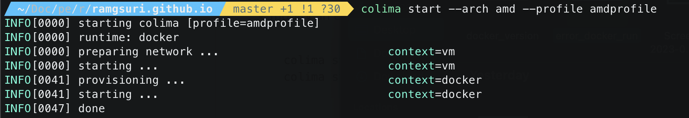

{: .box-note}       
If you are a Developer and trying to setup your new MAC M1 machine,
then this post can help you to get started with the Dev Machine setup.


### 1. Rosetta 2 
* Rosetta 2 is an x86–64 compatibility layer developed by Apple so you can install and run apps that 
haven’t been ported to ARM yet.

* Run the following command on terminal.
  ```shell
  /usr/sbin/softwareupdate --install-rosetta --agree-to-license on the terminal 
  ```

### 2. Xcode Command Line Tools
* These are the tools for software developers that run on the command line, that is, 
in the Terminal application (also called the console). These tools have been used for 
programming on Unix operating systems since long.
* Run the following command on terminal.
  ```shell
  xcode-select --install 
  ```

### 3. Homebrew
* Homebrew (brew) is a free and open-source package manager that allows installation of apps
and software in macOS.
* Run the following command on terminal to install homebrew.
  ```shell
  /usr/bin/ruby -e "$(curl -fsSL https://raw.githubusercontent.com/Homebrew/install/master/install)"
  ```
* Once homebrew is installed, make sure to setup this PATH in .zshrc or bash_profile file. 
This step is specifically for MAC M1 and order also matters otherwise brew doctor command 
will give warnings.
* 
* Once this is done you can run this below command to verify if your system is ready to use brew.
  ```shell
  brew doctor
  ```
  
  ```shell
  echo $HOMEBREW_PREFIX
  ```
  

### 4. Zsh & Ohmyzsh
* ZSH, also called the Z shell, is an extended version of the Bourne Shell (sh),
  with plenty of new features, and support for plugins and themes.
  ```shell
  brew install zsh && sh -c "$(curl -fsSL https://raw.githubusercontent.com/robbyrussell/oh-my-zsh/master/tools/install.sh)"
  ```
* These are the additional plugins that I installed in my Zsh
  * *For Syntax Highlighting*
  ```git
  git clone https://github.com/zsh-users/zsh-syntax-highlighting.git ${ZSH_CUSTOM:-~/.oh-my-zsh/custom}/plugins/zsh-syntax-highlighting
  ```  
  * *For Zsh Autosuggestions* 
  ```git
  git clone https://github.com/zsh-users/zsh-autosuggestions ~/.zsh/zsh-autosuggestions
  ```

### 5. Git
* Git is a free and open source distributed version control system (*DevOps Tool*) used for Source Code Management. 
  ```shell
  brew install git 
  ```
* Once git is installed then you can check the version by running command  "git --version".
  

* ***How to setup multiple Git Accounts ?***  
Your Mac has a SSH config file in a .ssh directory. The config file is where you establish relationships of your SSH keys
to each GitHub (or Bitbucket) account, and all your SSH keys generated are saved into .ssh directory by default.
  1. **Creating the SSH keys:**
     ```shell
     ssh-keygen -t rsa -b 4096 -C "your_email@example.com"     
     ```
  2. Register your keys to respective Github accounts. Follow these 
  [steps](https://docs.github.com/en/authentication/connecting-to-github-with-ssh/adding-a-new-ssh-key-to-your-github-account) to do so.
  3. **Go to SSH config file at ~/.ssh and amend accordingly to:**
     ```git
     #personal github user1-account
     Host github.com
     HostName github.com
     User git
     IdentityFile ~/.ssh/id_rsa
     IdentitiesOnly yes
          
     #github.abc.com user2-account
     Host github.com
     HostName github.com
     User git
     IdentityFile ~/.ssh/jd_git_id_rsa
     IdentitiesOnly yes
     ```
     
  4. Go ahead to git clone your respective repository.
  5. Open up local git config using git config --local -e and add:
     ```git
     [user]
          name = user1
          email = user1@gmail.com
     ``` 
   6. Run git config --list to view git configurations.

### 6. IntelliJ
* IntelliJ IDEA is the professional IDE that enables enterprise and full-stack application development 
& JVM development.
  ```shell
  brew install --cask intellij-idea
  ```

### 7. Colima
* I found [Colima](https://github.com/abiosoft/colima/) to be a great drop-in replacement for Docker Desktop.
If you need to run containers on your Mac, Colima is an open-source container runtime with minimal setup that works on 
MacOS and Linux.
* If you already have Docker installed on your MAC then you can run these commands to cleanup and uninstall Docker Desktop app.
  ```shell
  brew uninstall --cask docker
  rm -rf ~/.dockercfg
  ```
* Now since you have installed brew then using brew you can setup Colima on your MAC in the fastest way.
  * Install Colima
    ```shell
    brew install Colima 
    ```
  * Once Colima is installed then install Docker
    ```shell
    brew install Docker
    brew install docker-credential-helper
    ```
  * Now install Docker Compose  
    ```shell
    mkdir -p ~/.docker/cli-plugins
    curl -SL https://github.com/docker/compose/releases/download/v2.2.3/docker-compose-darwin-aarch64 -o ~/.docker/cli-plugins/docker-compose
    chmod +x ~/.docker/cli-plugins/docker-compose
    ```
  * Now start the colima  
    ```shell
    colima start
    ```
    
  * To verify the installation
    ```shell
    docker compose Version
    ```
    
    ```shell
    docker run hello-world
    ```
    Now if you face this issue and unable to pull the hello-world image.
    Error Like : 
    ```git
    Error response from daemon: Get "https://registry-1.docker.io/v2/": dial tcp:  
    lookup registry-1.docker.io on 192.168.5.3:53: read udp 192.168.5.15:51522->192.168.5.3:53: i/o timeout
    ```
    
    Then try starting the colima with specific configurations of amdprofile: 
    ```shell
    colima start --arch amd --profile amdprofile
    ```
    
  * Now try pulling the image again by running the command : $ **docker run hello-world**
    
    